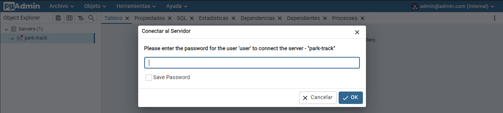
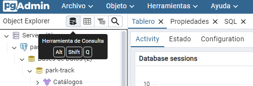

Si ya tienes activo el contenedor que creaste con el archivo `docker-compose.yml`, solo debes ir
a "http://127.0.0.1/login?next=/browser/" en tu navegador. Luego, ingresa con el usuario `admin@admin.com` y la
contraseña `admin` (puedes cambiar el idioma de la página si lo prefieres). A continuación, haz doble clic en
"Servidores" o "Servers". Esto te mostrará la siguiente pantalla:

Aquí deberás ingresar la contraseña del usuario que configuramos para la base de datos. En nuestro caso, la contraseña
asociada al usuario `user` es `password`. Finalmente, si deseas utilizar un script, puedes hacer uso de la herramienta
de consulta haciendo clic en la siguiente parte:

Esto abrirá un espacio en el que podrás interactuar directamente con la base de datos utilizando SQL puro.